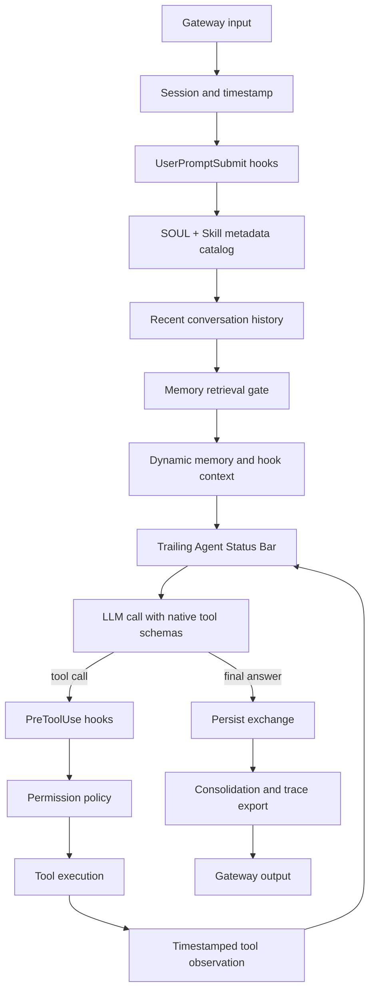

<div align="center">

# Otto

### A transparent, local-first agent runtime with memory, skills, tasks, and context governance

[MIT License](LICENSE) · [Python 3.11+](https://www.python.org/) · [PostgreSQL + pgvector](https://www.postgresql.org/) · [Testing](#testing)

**Documentation:** [Architecture](docs/architecture.md) · [Prompt Runtime](docs/prompt-runtime.md) · [Skills](docs/skills.md) · [Agent Status](docs/agent-status.md) · [Context Compaction](docs/context-compaction.md)

<sub>Agent Loop · Lifecycle Hooks · Progressive Skills · Long-Term Memory · Knowledge RAG · Task System · Subagents · Sandboxed Tools</sub>

</div>

## Overview

Otto is a readable agent runtime for people who care about how an agent actually works. It keeps the important machinery visible: prompt assembly, model/tool iteration, permission checks, memory retrieval, Skill activation, task progress, context compaction, subagent isolation, and tracing.

It is deliberately built from small Python modules instead of hiding the execution path behind a large framework. Every major mechanism maps to a file you can inspect, test, and replace.

The design follows one rule throughout: **stable instructions stay at the front; dynamic observations are appended near the model's generation point.** This preserves prompt-cache-friendly prefixes while keeping current tasks, environment state, tool counts, retrieved memory, and errors visible when they matter.

---

## Core Modules

### 🔁 Transparent Agent Loop

[`otto/loop/agent.py`](otto/loop/agent.py) owns the model → tool → observation cycle. It supports native tool calls, bounded iterations, tool-result timestamps, Stop hooks, permission checks, active Skill tracking, and layered context compaction.

The loop exits when the model returns a final answer without tool calls, or when a deterministic guardrail stops further execution.

### 🪝 Lifecycle Hooks

[`otto/hooks.py`](otto/hooks.py) provides one event bus for the whole runtime:

- prompt submission and pre-LLM context
- model start/end events
- pre/post tool execution
- terminal permission decisions
- memory, graph, subagent, and Stop events
- read-only observers for gateways and tracing

Behavior can be extended without embedding unrelated logic inside the agent loop. Permission enforcement remains the terminal phase, so an ordinary hook cannot rewrite an approved operation afterward.

### 🧠 Four-Part Memory System

Otto uses PostgreSQL as its single structured-data backend:

| Memory | Purpose | Storage and retrieval |
|---|---|---|
| **Semantic** | durable user facts and preferences | PostgreSQL full-text search |
| **Episodic** | dated events and conversation summaries | PostgreSQL with chronological retrieval |
| **Procedural** | instructions for how to perform work | `SKILL.md` packages on disk |
| **Knowledge RAG** | imported PDF, DOCX, and text content | PostgreSQL FTS + pgvector HNSW |

A retrieval gate decides whether a turn needs long-term memory before searching. Conversation consolidation runs in batches and only marks source messages complete after durable facts and episodes have been written successfully.

`.otto/MEMORY.md` remains a human-readable mirror; PostgreSQL is the queryable source of truth.

### 🧩 Progressive Skill Loading

Skills are domain workflows, not another pile of permanent tools.

1. At startup, only each Skill's `name` and routing-oriented `description` enter the stable system prompt.
2. When needed, the model calls `load_skill` and receives the complete `SKILL.md` as a tool result at that point in the trajectory.
3. Detailed references, scripts, templates, and assets are loaded only when the active Skill asks for them.

This gives the model discoverability without paying the context cost of every full Skill on every request. See [Skills](docs/skills.md).

### 📋 Task System and Agent Status Bar

Otto combines persistent tasks with a code-generated status message. Tasks support `pending`, `in_progress`, `completed`, and deleted states, dependencies, ownership, and session/shared scopes.

Before every model generation, [`otto/runtime/status.py`](otto/runtime/status.py) appends a final user-role framework message containing:

- current time and timezone
- workspace, operating system, shell, and Python version
- loop iteration and remaining budget
- task progress and the current work item
- tool-call counts, failures, and repeated-call warnings
- last observation and active Skills

The status bar is recomputed by code, never by another model. It is not persisted into conversation history and never replaces the original context.

### 📐 Context Governance

[`otto/runtime/context.py`](otto/runtime/context.py) uses a layered strategy:

1. archive oversized tool results and retain bounded previews
2. compact older tool observations while preserving call/result pairs
3. safely trim old trajectory prefixes at message boundaries
4. ask a small model for a structured summary near the context limit
5. preserve recent messages and re-inject active Skill instructions
6. fail open to deterministic recovery if summarization fails

The trigger reserves both output capacity and a safety buffer instead of waiting for a provider overflow error. See [Context Compaction](docs/context-compaction.md).

### 🤝 Subagents

Otto supports isolated specialist runs for research, planning, review, and analysis. Native subagents receive a bounded context and role-specific tool allowlist; read-only roles cannot silently gain write, shell, or Python execution privileges.

The parent remains the orchestrator. Child results return as tool observations, so the same Hook, permission, tracing, task, and context systems remain in force. See [Subagents](docs/subagents.md).

### 🛠️ Small General Tool Surface

The permanent execution surface stays compact while Skills provide changing domain workflows:

| Tool | Role | Safety boundary |
|---|---|---|
| `read_file` | paginated text reads | workspace-bound canonical paths |
| `write_file` / `apply_patch` | file mutation | approval required, atomic writes |
| `list_files` / `search_files` | repository discovery | workspace-bound |
| `run_command` | general terminal execution | explicit approval, timeout, clean environment |
| `python` | code interpretation | OS sandbox, no network, isolated write directory |
| `fetch_url` | bounded HTTP(S) retrieval | public-address validation, redirect and size limits |

Domain operations with strict permissions or structured parameters remain dedicated tools. See [General Tools](docs/general-tools.md).

### 🔍 Observability and Evaluation

Every turn produces a JSONL trace under `.otto/traces/`. Optional OpenTelemetry export supports external trace viewers without changing the loop.

The evaluation layer separates two different questions:

- deterministic tests: did the correct mechanism and tool behavior occur?
- model-judged tests: was the final response useful and high quality?

The release gate requires deterministic correctness before considering judge scores.

---

## Request Lifecycle



### Prompt assembly order

```text
request
├── system: SOUL → Skill name/description catalog
├── tools: name → description → input schema
└── messages
    ├── bounded recent history
    ├── timestamped current user input
    ├── assistant/tool trajectory
    ├── optional retrieved memory and hook context
    └── trailing <agent_status> snapshot
```

Provider and model names are not injected into the prompt. Tool definitions use the provider's native `tools` field rather than being rendered as system text.

---

## Quick Start

### 1. Install PostgreSQL and pgvector

On macOS with Conda:

```bash
conda install -c conda-forge postgresql pgvector

initdb -D ~/.local/share/otto/postgres -U "$USER" --auth=trust --encoding=UTF8
pg_ctl -D ~/.local/share/otto/postgres -l ~/.local/share/otto/postgres.log start
createdb otto
psql -d otto -c 'CREATE EXTENSION IF NOT EXISTS vector'
```

If PostgreSQL is already running, only the database and extension commands are needed.

### 2. Install Otto

```bash
git clone https://github.com/dingkai0321/otto-agent.git
cd otto-agent

uv venv
uv pip install -e '.[dev,knowledge]'
cp .env.example .env
```

### 3. Configure one model provider

```env
OTTO_PROVIDER=anthropic
ANTHROPIC_API_KEY=your-key-here
```

Provider adapters are also available for OpenAI, Gemini, DeepSeek, Kimi, MiniMax, GLM, OpenRouter, xAI, OpenCode Zen, and OpenCode Go.

### 4. Run

```bash
make run
```

Or use the installed command directly:

```bash
otto
```

Start the local dashboard:

```bash
otto dashboard
```

The dashboard listens on `127.0.0.1:7777` by default.

---

## Knowledge RAG

Import documents:

```bash
otto knowledge add handbook.pdf policy.docx notes.md
```

Inspect sources and retrieval:

```bash
otto knowledge list
otto knowledge search "What is the refund policy?"
```

Text chunks are indexed with PostgreSQL full-text search. When an embedding key is configured, pgvector adds semantic similarity; ranking combines both signals.

---

## Useful Commands

| Command | Purpose |
|---|---|
| `otto` or `make run` | terminal conversation |
| `otto dashboard` or `make dashboard` | browser cockpit |
| `otto voice` or `make voice` | optional voice gateway |
| `otto brief` | loop-based morning briefing |
| `otto gather` | graph-arranged parallel gathering workflow |
| `otto knowledge add ...` | import knowledge documents |
| `otto skill install <url>` | install a Skill package |
| `make eval` | deterministic evaluation suite |
| `make lint` | static checks |

Inside a conversation, `/context` reports the current context budget and `/compact` requests manual compaction.

---

## Project Map

```text
otto/
├── app.py                 # application orchestration
├── hooks.py               # lifecycle bus and terminal permission hook
├── permissions.py         # deny → rules → approval policy
├── gateway/               # CLI, voice, Discord, WhatsApp
├── loop/                  # provider adapters and agent loop
├── runtime/               # prompt, session, status bar, compaction
├── memory/                # semantic, episodic, procedural, Knowledge RAG
├── tasks/                 # PostgreSQL-backed task model
├── tools/                 # general and domain tools
├── graph/                 # optional structured workflows around the loop
└── ops/                   # dashboard, tracing, evaluation, release gate

skills/                    # built-in and community Skill packages
evals/                     # deterministic and model-judged evaluations
docs/                      # architecture and mechanism documentation
```

---

## Testing

Run the deterministic suite without invoking a paid model:

```bash
ANTHROPIC_API_KEY= OTTO_API_KEY= make eval
```

Current local result:

```text
483 passed, 11 skipped
```

The skipped cases are optional live-provider evaluations. Static checks:

```bash
make lint
```

---

## Security Model

- `.env`, `.otto/`, credentials, traces, and generated artifacts are excluded from publication.
- File tools resolve canonical paths and enforce the configured workspace boundary.
- Writes and host commands require permission according to runtime policy.
- Sandboxed Python runs without network access and cannot write arbitrarily into the workspace.
- URL fetching rejects private, loopback, link-local, credential-bearing, and unsafe redirect targets.
- Unattended gateways fail closed when an operation requires interactive approval.

These boundaries reduce risk; they are not a substitute for operating-system isolation when handling untrusted workloads.

---

## Tech Stack

Python 3.11+, PostgreSQL, pgvector, Rich, optional OpenTelemetry, and adapters for Anthropic, OpenAI, and other compatible model providers.

---

## License

[MIT](LICENSE). See the license file for copyright and attribution details.

---

<div align="center">

<sub>Built for understanding, extending, and testing the full agent data path.</sub><br>
<sub>If Otto helps you build a better agent, a ⭐ is appreciated.</sub>

</div>
