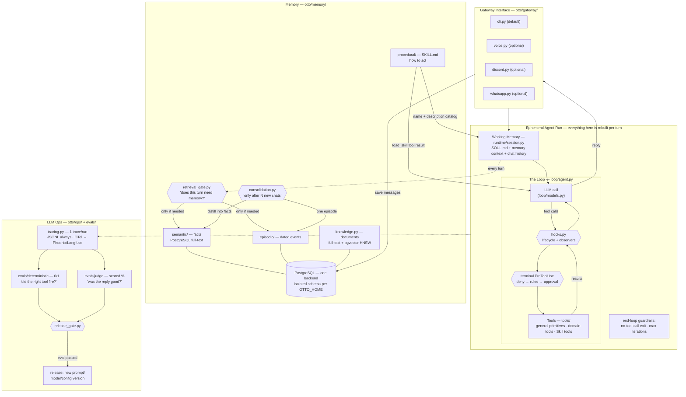

# Architecture — the whiteboard, refreshed

The same system as the two whiteboard diagrams from the previous videos
(the generic Harness/Loop/Memory/LLM-Ops one and the Hermes-specific one),
now with a file path on every box.

## Design decisions worth stealing

- **The gate before retrieval** (not retrieval on every turn): a cheap-model judge
  answers "does this message need the user's memory?" — saves latency and, more
  importantly, keeps irrelevant memories from biasing answers.
- **The gate before execution** is deterministic code, not a prompt. Hard-denied
  shell operations never run; contextual risks require CLI/Dashboard approval;
  unattended gateways fail closed. Ordinary tool calls keep the direct path.
- **A small general execution surface supports many Skills.** Workspace-bound
  read/list/search/write/patch tools, an explicitly host-side approved terminal,
  sandboxed Python, and bounded public URL fetches stay stable while domain
  workflows evolve in `SKILL.md`. See `docs/general-tools.md`.
- **Hooks keep the loop stable.** Prompt, LLM, tool, permission, memory, graph,
  sub-agent and Stop events all cross one run-scoped `HookManager`. Tracing and
  gateway Observers are read-only hooks; behavioral callbacks can update or
  block lifecycle context. Permission is a terminal phase over final arguments,
  so a normal hook cannot rewrite a safe command after it was approved.
- **Consolidation is batched** ("after N chats"), asynchronous to the reply path,
  and loss-safe: if the summarizer fails, the chat log stays unconsolidated.
- **Deterministic evals and judge evals never mix.** One is a unit test, the other
  is a scored opinion. The release gate requires 100% of the first and a threshold
  on the second.
- **One structured-data backend** — facts, episodes, chats, local calendar, and
  document chunks share PostgreSQL; pgvector adds semantic retrieval without a
  second database service.
- **Graphs wrap the loop, never replace it.** When a turn needs shape (parallel
  steps, explicit routing), an opt-in graph workflow (`otto/graph/`) arranges nodes
  around the untouched loop — the `full_agent` node IS `run_loop`. Routers are plain
  code reading state a model wrote; every failure fails open to the plain loop; the
  dashboard renders the topology from the engine's own `describe()` so the picture
  can't drift. See `docs/agent-graphs-design.md`.

## What this deliberately is not

Not a framework, not multi-agent, not production. (Still not multi-agent even with
graph workflows: a graph's `agent_node` is the same loop invoked as one step — no
peer-to-peer agent messaging, execution follows the edges deterministically.) It's
the readable blueprint — OpenClaw and Hermes are the products; this is the afternoon
read that explains them.
